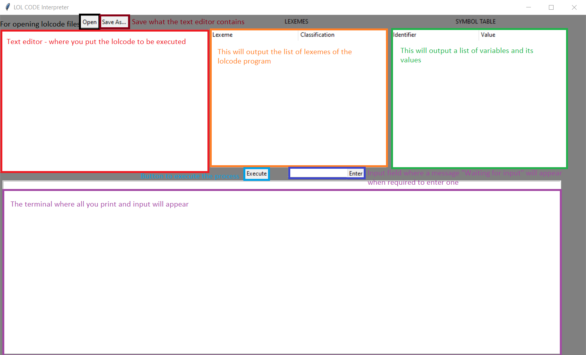

# AUTHOR: FRANCIS E. BEJOSANO
# DATE: 08/11/2022

# LOL CODE Interpreter

This is a LOL CODE interpreter built with Python and Tkinter. It provides a graphical interface for interpreting LOL CODE, with lexeme and symbol tables displayed, along with an execution output area.

## Requirements

- **Python 3.x**
- **Tkinter** (comes pre-installed with Python on most systems)

## Dependencies

To run this interpreter, you will need the following dependencies installed:

- `tkinter`
- `ttk` (part of the `tkinter` package)
- `messagebox` (part of the `tkinter` package)
- Custom modules:
  - `lexical_analyzer.py` (for lexeme analysis)
  - `syntax_analyzer.py` (for syntax analysis)

> **Note:** Ensure the `lexical_analyzer.py` and `syntax_analyzer.py` files are in the same directory as this script.

## Installation Guide

### Installing Python 3.x

#### Windows

1. Download the latest Python installer from [python.org](https://www.python.org/downloads/).
2. Run the installer. Ensure the checkbox **"Add Python to PATH"** is selected.
3. Verify installation by running in Command Prompt:
   ```bash
   python --version

### macOS

1. **Download Python**:  
   Visit the official Python website:  
   [https://www.python.org/downloads/](https://www.python.org/downloads/).

2. **Run the Installer**:  
   Download the latest Python installer and run it. The installer will guide you through the installation process.

3. **Verify Installation**:  
   After installation, open **Terminal** and verify Python is installed by typing:
   ```bash
   python3 --version

### Ubuntu

1. **Update Package List**:  
   Open the terminal and update your package list:
   ```bash
   sudo apt update

2. **Install Python 3**:
   Install Python 3 and pip3 (Python's package installer) with the following command:
   ```bash
   sudo apt install python3 python3-pip

3. **Verify Installation**:  
   After installation, open **Terminal** and verify Python is installed by typing:
   ```bash
   python3 --version

## Parts of the GUI and its uses

